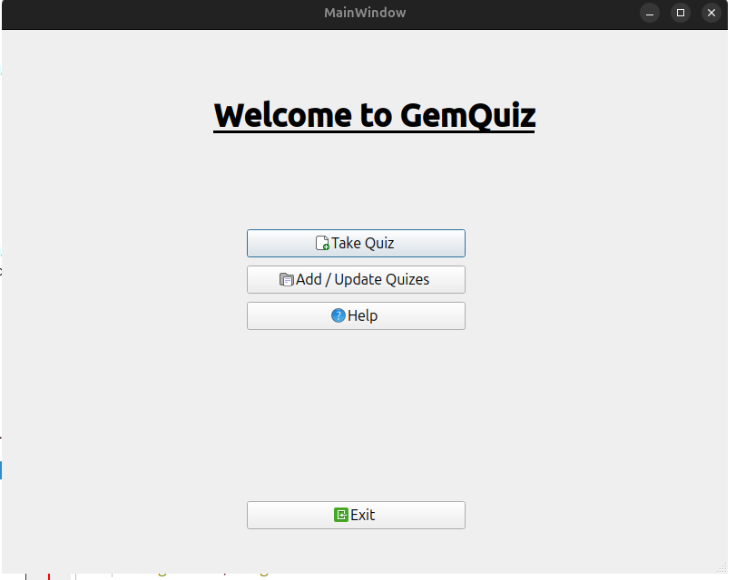

## GemQuiz

### To run the project
1. Clone the repository
2. Goto /build/Desktop-Release
3. Run the gem-quiz.exe

### To build the project
1. Download QT Creator on your desktop
2. Open CMakeList.txt in you QT Creator, there you can edit the code and rebuild it.
